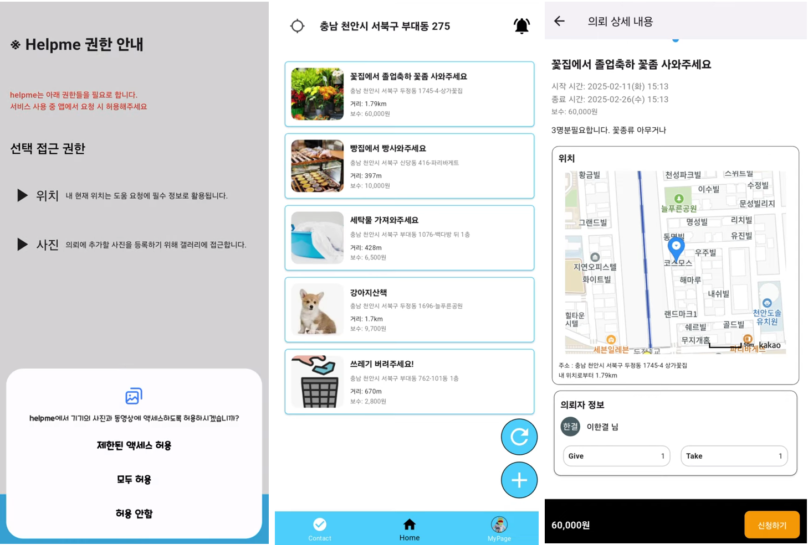

## 👤Profile

2024 국립공주대학교 KDT 수료생

- **Contact**
    - E-mail : <a href="mailto:kt092805@gmail.com?subject=문의&body=내용을 입력해주세요">kt092805@gmail.com</a>

- **Github** 
    - Link : [https://github.com/eropick](https://github.com/eropick)

<!-- &nbsp; -->

## 🎓Education
- 국립공주대학교 컴퓨터공학부 컴퓨터공학전공 학사 졸업(차석) | `19.03 ~ 25.02`
- 한국정보교육원 자바 스프링 리액트로 완성하는 클라우드 활용 풀스택 개발 과정 수료 | `24.06 ~ 25.02`

## 📜Certification
- TOPCIT( 670 / 수준4 ) | `24.11`
- SQL 개발자( SQLD ) | `24.09`
- 정보처리기사 | `24.06`
- 컴퓨터활용능력 1급 | `22.07`

## 🔧Skills
- **Compile Language**
    - 

        - Java 기본 문법을 활용한 객체지향 코드 작성 가능
        - Singleton과 Builder 패턴에 대한 이해 및 모델 설계 가능
        - Servlet 또는 Spring MVC 패턴을 활용한 REST API 작성 가능
        - TCP 소켓 프로그래밍을 통한 TCP 서버 구현 경험
    -  : Flutter에서 사용하는 Dart 언어를 사용한 안드로이드 앱 개발 경험
    - C : Windows API를 활용한 GUI 프로그래밍(자료구조 시각화 제작) 경험
    - C++ : SFML 라이브러리를 활용한 토이 프로젝트(당구 게임 제작) 경험
    -  : 닷넷 Windows Form을 활용한 GUI 프로그래밍(공학용 계산기 제작) 경험
- **Interpreter & Script Language**

    -  : 기본 문법과 Django 웹 프레임워크를 활용한 실시간 편집 사이트 제작 경험
    -  : 웹 애플리케이션의 이벤트 처리 함수 작성 및 fetch JSON 데이터 처리
- **Front-end**
    - Web Design
        - HTML : HTML과 CSS를 활용한 웹 구조 디자인 경험
    -  : Dart 언어를 활용한 안드로이드 앱 개발 프로젝트 경험
- **Back-end**
    - Web Framework
        -  : Spring Web MVC와 Security, JPA를 활용한 백엔드 개발 경험
        -  : Django Template 언어와 Python을 활용한 서버 사이드 웹 개발 경험
    
    -  : SQL을 사용한 DB 생성 및 테이블 설계 가능
    -  : ExpressJS, socketIO, WebRTC 기술을 적용한 P2P 환경 구축 경험
- **Collaboration**

    -  : 템플릿을 활용하여 협업 문서 작성 경험

## 👥Key Project

### Helpme! 도우미 매칭 시스템

**[진행 기간]** 
- `25.01.17 - 25.02.13, 개발인원 4명`

**[개요]** 
- 우리들은 일상에서 혼자 해결할 수 없는 어려움들이 종종 존재함
- 지역 근처의 사람들에게 의뢰하여 문제를 해결하고 주변인들은 이를 해결해주며 수익을 창출할 수 있는 기회 제공
- 접근성이 좋은 모바일 애플리케이션 개발

**[아키텍처]** 

**[담당]  Full-Stack**
- Front
    - 로그인 인증 및 보안/권한 고지 페이지 제작
    - 게시글 조회/등록/재등록 페이지 제작
    - 공통 클라이언트-서버 연결 로직 제작
    - 공통 위치 정보 인출 로직 제작
- Back
    - Spring Security 활용 Url 필터와 토큰 기반 인증 처리
    - Spring Web MVC 적용 및 Rest API 설계 및 작성
    - JPA Repository 이용 쿼리 작성
    - 푸시 알림 REST API 트리거 구현
    - 에러 검토 및 수정
    - AWS 서버 배포

**[프로젝트 구조]**
- [Flutter Directory](https://github.com/eropick/eropick.github.io/blob/main/kdt_project/Location_based_matching_project-3/flutter_project_directory.md)
- [Spring Directory](https://github.com/eropick/eropick.github.io/blob/main/kdt_project/Location_based_matching_project-3/spring_project_directory.md)

**[결과 보고서]**
- [슬라이드 요약](https://eropick.github.io/image_slider/index.html?dir_name=helpme)
- [report](https://github.com/eropick/eropick.github.io/blob/main/kdt_project/Location_based_matching_project-3/HelpMe!_Report.pdf)

**[시연]**  [Helpme 시연 영상](https://www.youtube.com/watch?v=UELlz0jtkVM&list=PLeIymhSKOH64BZ1DfBw_5RibDxAHDUvmo&index=2)

---

    
外 주요 프로젝트 목록

    <main>&nbsp;

**실시간 문서 편집 도구 제작** : [Real-time-editor](./capstone_project/real_time_editor.md)

**멀티룸 예약 관리 서비스** : [Multi-room-Reservation](./kdt_project/Multiroom_Reservation_project-2/multi_room.md)

**웹 기반 벽돌 깨기 게임** : [Brick-out Web Game](./kdt_project/Brickout_project-1/brickout.md)
    </main>

## 🎯 Study

    
목록

    <main>&nbsp;

**1. 자모 분해 결합** : [Jamo](./solo_project/Jamo/jamo.md)

**2. 디지털/아날로그 시계** : [GraphicClock](./solo_project/Graphic_Clock/clock.md)

**3. 단어장** : [Voca](./solo_project/ProjectVoca/voca.md)

**4. 유튜브 플레이리스트** : [Playlist](./solo_project/Youtube_PlayList/playlist.md)

**5. 로또** : [Lotto](./solo_project/Lotto/lotto.md)

**6. JS 유틸 제작** : [UtilJS](./solo_project/Util_js/util.md)

**7. 스택** : [Stack](./solo_project/Stack/stack.md)

**8. 구구단** : [TimesTable](./solo_project/Times_Table/times_table.md)
    </main>

