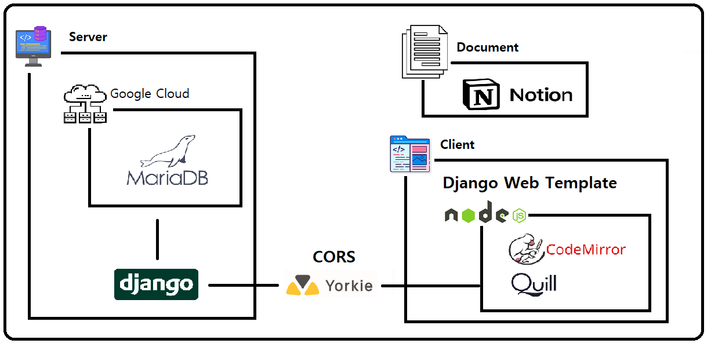
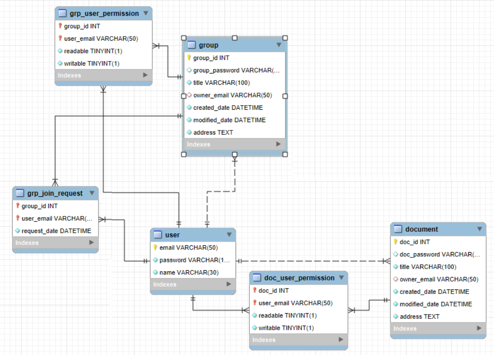
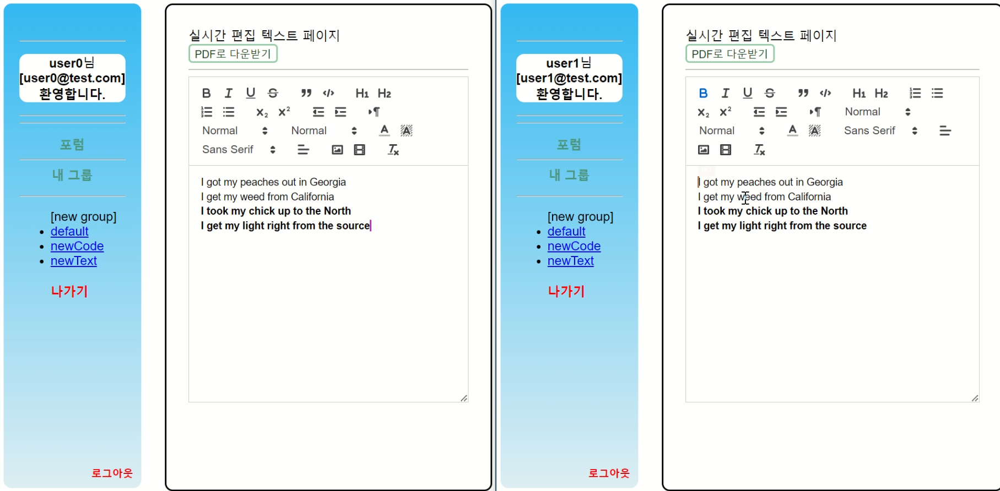

### 웹 기반 실시간 문서 편집 도구(with Yorkie)

**[진행 기간]** 
- `24.03 ~ 24.06, 개발인원 3명`
- `개발` : [gimdongjin](https://github.com/gimdongjin), [eropick](https://github.com/eropick), [dorocy1218](https://github.com/dorocy1218)

**[개요]** 
- 팀 프로젝트에 사용가능한 실시간 코드/텍스트 편집 협업 도구
- 변화를 추적하고 통합하는 것이 아닌 실시간 코드 수정 및 통합
- 소규모 프로젝트에서 팀원들 간 Pair 프로그래밍 이점
- 현대의 실시간 소통 프로그램들과 연동의 이점

**[아키텍처]** 
- Django Templates / nodeJS 활용
- MPA 서버사이드 렌더링 및 CORS 도메인 연결

**[담당]  Full-Stack**
- Front
    - 그룹 검색 페이지 작성
    - 실시간 편집 페이지 작성
    - 코드 하이라이트 및 권한 페이지 구현
    - 메시지 핸들링을 통한 페이지간 데이터 전송 인터페이스 작성
- Back
    - 그룹 및 문서 데이터 모델링
    - 그룹 검색 기능 페이지네이션 적용
    - 그룹 및 문서 권한 관리 로직 작성
    - 실시간 편집 Django 프로젝트 통합

**[프로젝트 구조]**
- [Project Directory](https://github.com/eropick/eropick.github.io/blob/main/capstone_project/project_directory.md)

**[결과 요약 보고서]**
- [report](https://github.com/eropick/eropick.github.io/blob/main/capstone_project/realtime_editor_summary)

**[시연]**  [웹 기반 실시간 문서 편집 도구](https://www.youtube.com/watch?v=xWOELCkwIcM&list=PLFxn_48ugVWbaCNlhuQGWnOcbdwCbFloE&index=1)

