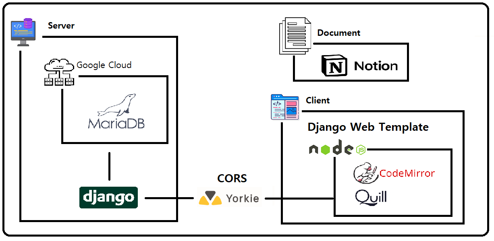
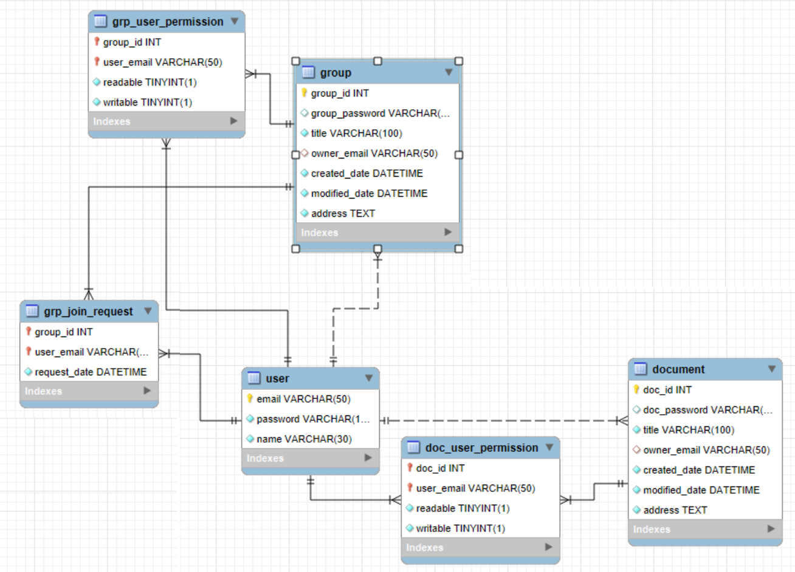
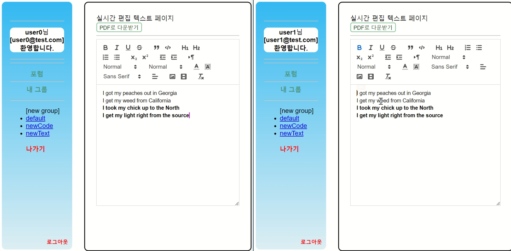

### 웹 기반 실시간 문서 편집 도구(with Yorkie)

**[진행 기간]** 
- `24.03 ~ 24.06, 개발인원 3명`
- `매주 월요일 회의`
- `개발` : [gimdongjin](https://github.com/gimdongjin), [eropick](https://github.com/eropick), [dorocy1218](https://github.com/dorocy1218)

**[개요]** 
- 우리들은 일상에서 혼자 해결할 수 없는 어려움들이 종종 존재함

**[아키텍처]** 
- Django Templates / nodeJS 활용
- MPA 서버사이드 렌더링 및 CORS 도메인 연결

**[담당]  Full-Stack**
- Front
    - 로그인 인증 및 보안/권한 고지 페이지 제작

- Back
    - Django 웹소켓 활용을 위한 Redis 통합

**[프로젝트 구조]**
- [Project Directory](미완성)

**[결과 요약 보고서]**
- [report](https://github.com/eropick/eropick.github.io/blob/main/capstone_project/realtime_editor_summary)

**[시연]**  [웹 기반 실시간 문서 편집 도구](https://www.youtube.com/watch?v=xWOELCkwIcM&list=PLFxn_48ugVWbaCNlhuQGWnOcbdwCbFloE&index=1)

