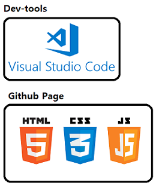
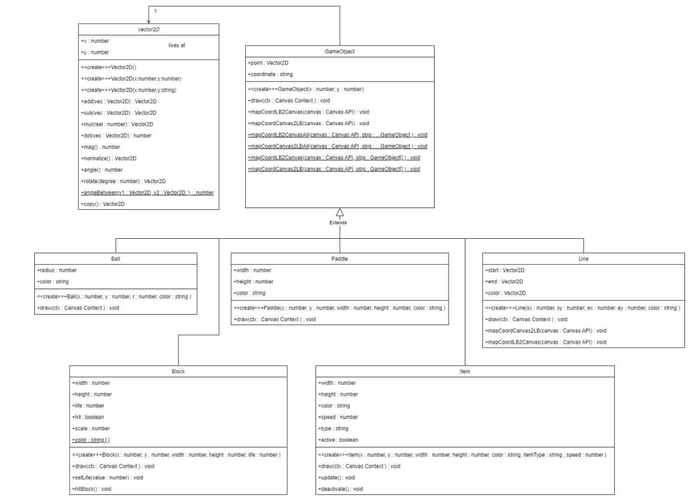
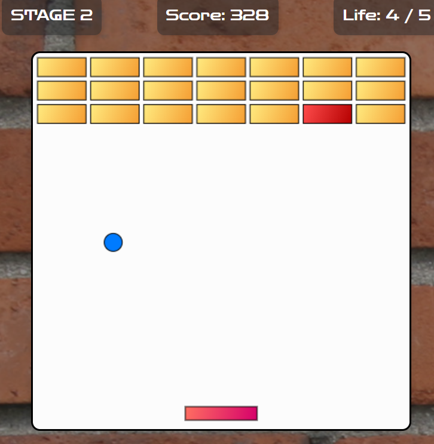

### 웹 기반 벽돌깨기 게임 제작

**[진행 기간]** 
- `24.07.11. - 25.07.22, 개발인원 3명`

**[개요]** 
- HTML5(HTML/CSS/JS)를 활용하여 벽돌깨기(Breakout-style) 웹 게임 제작
- 별도의 물리 엔진이 들어간 라이브러리 없이 직접 물리적인 로직 구현
- 고전적인 벽돌깨기에 아이템, 콤보, 스테이지 등 게임 요소 적용
 
**[담당]  JavaScript-Logic**
- Logic
    - 초기 게임 요소 클래스화
    - 공의 충돌 처리(벽돌, 엣지) 로직 적용
    - 평면 벡터 적용 및 좌표계 변환 로직 작성
    - 드래그를 통한 공의 이동 방향 지정 로직 적용
- UI
    - 옵션 : 모달 대화상자 및 재시작/일시정지/속도 조절 기능 추가

**[시스템 아키텍쳐]**

**[프로젝트 구조]**
- [Project Directory](https://github.com/eropick/eropick.github.io/blob/main/kdt_project/Brickout_project-1/project_directory.md)
- 클래스 다이어그램 

**[결과 보고서]**
- [report](https://github.com/eropick/eropick.github.io/blob/main/kdt_project/Brickout_project-1/Brickout_report.pdf)

**[시연]** [벽돌깨기 웹 게임](http://eropick.github.io/kdt_project/Brickout_project-1/Brickout/Brickout.html)

