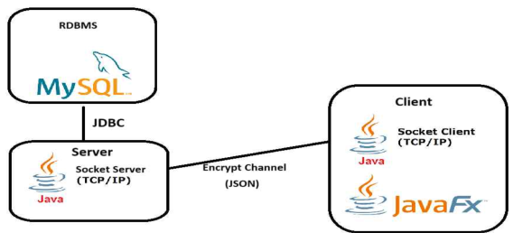
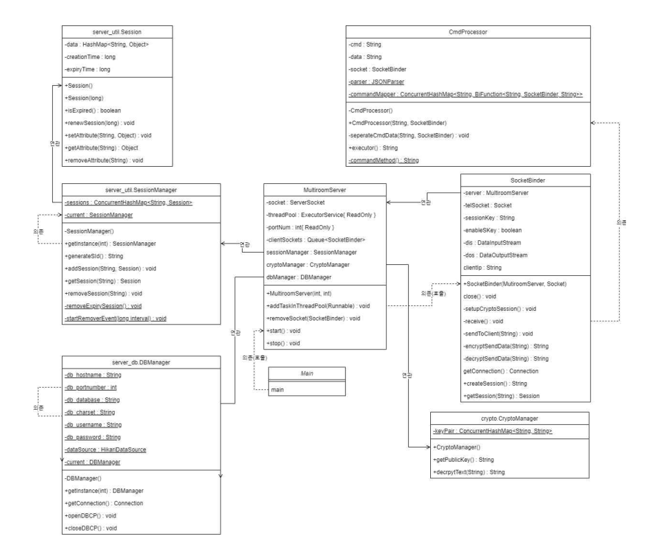
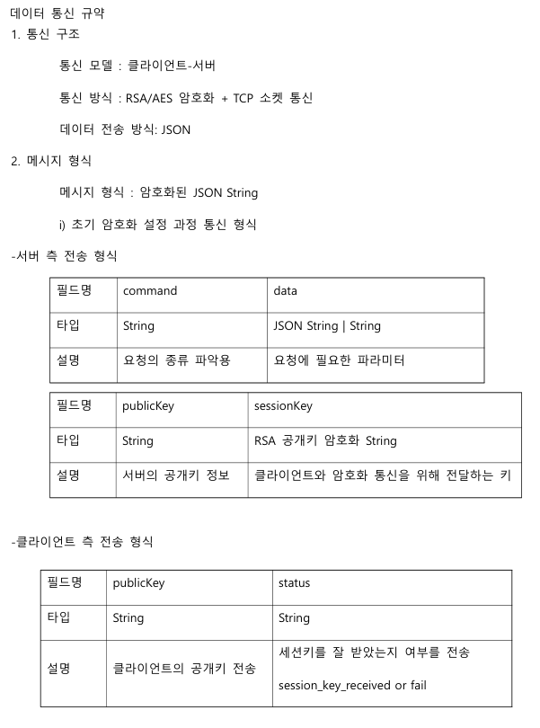
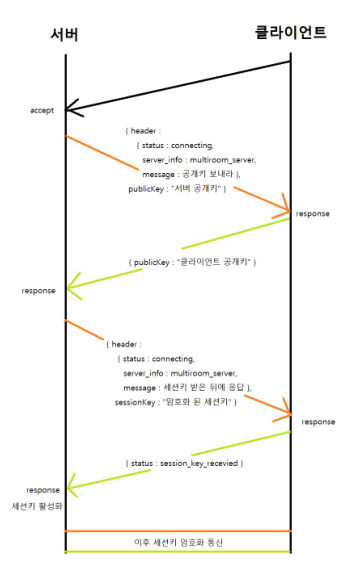
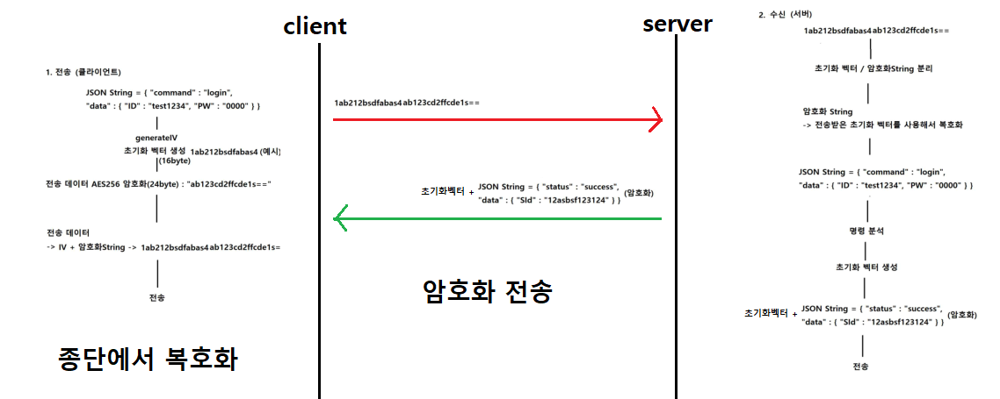
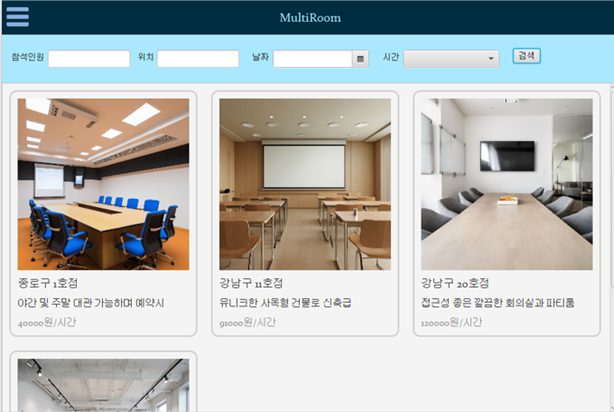

### 멀티룸 예약 관리 플랫폼 개발(공간잇기)

**[진행 기간]** 
- `24.08.26 - 24.09.25, 개발인원 4명`

**[개요]** 
- 다수를 수용할 수 있는 공간(멀티룸)을 대여해주고 파트너들이 수익 창출할 수 있는 멀티룸 예약 관리 플랫폼
- JavaFX를 사용한 프론트엔드 및 TCP 소켓 프로그래밍을 통한 서버 및 백엔드 구현
- 사용자들이 방을 예약하고 업체에서는 관리를 할 수 있도록 사용자/관리자 메뉴 분리
 
**[담당] Backend**
- Front
    - 로그인 유효성 검사 및 보안 검토
    - 클라이언트-서버 통신 클래스 제작 및 예제 작성
- Back
    - HTTP와 유사한 Stateless 통신 방식 적용
    - 쓰레드 풀을 사용하여 서버 동시 접속 기능
    - RSA-AES암호화 통신 프로토콜 설계 및 적용
    - Json 데이터를 파싱하고 분석하는 명령 해석 및 처리 기능 구현
    - ConcurrentHashMap을 활용한 명령어-메서드 mapper(매핑 기능) 구현
    - DB 커넥션 풀 라이브러리 활용 DB 커넥션 관리 기능 통합
    - SHA256을 활용한 패스워드 단방향 해싱 암호화 적용
    - 서버 연결 타이머/세션 관리/응답 메시지 포맷 등 유틸 클래스 작성
    - 코드 활용 예제 작성
    - DB 에러 검토 및 오류 수정
    - 배치 스크립트 활용 프로젝트 배포

**[시스템 아키텍쳐]**

**[프로젝트 구조]**
- [JavaFX Project Directory](https://github.com/eropick/eropick.github.io/blob/main/kdt_project/Multiroom_Reservation_project-2/javafx_project_directory.md)
- [Server Project Directory](https://github.com/eropick/eropick.github.io/blob/main/kdt_project/Multiroom_Reservation_project-2/server_project_directory.md)

- 서버 클래스 다이어그램 

- [통신 프로토콜 설계]
    - [파일 송수신 산출물](https://github.com/eropick/eropick.github.io/blob/main/kdt_project/Multiroom_Reservation_project-2/custom_file_transfer_protocol.pdf)
    - [데이터 암호화 송수신 산출물](https://github.com/eropick/eropick.github.io/blob/main/kdt_project/Multiroom_Reservation_project-2/data_transfer_protocol.pdf)
    

- 암호화 통신 과정
    
    

**[결과 보고서]**
- [report](https://github.com/eropick/eropick.github.io/blob/main/kdt_project/Multiroom_Reservation_project-2/multiroom_reservation_management_report.pdf)

**[시연 영상]** [멀티룸 예약 관리 플랫폼](https://www.youtube.com/watch?v=oJLAt4fmx10&list=PLFxn_48ugVWYReQCwFhe-u3dPMN_kV6A5&index=1)

