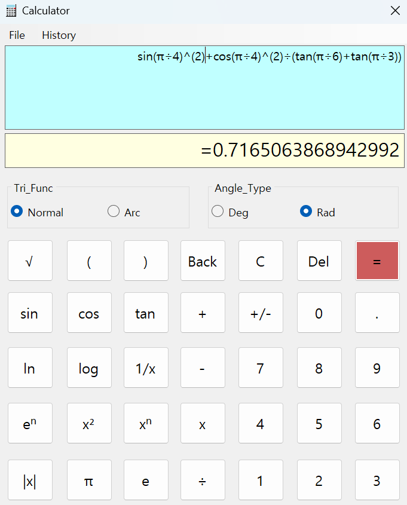

### 공학용 계산기 

**[배경]** 

<pre>
Queue, Stack을 이용한 중위-후위표기식 변환 및 SyntaxTree 활용 공학용 계산기 제작
</pre>
 
**[구현 내용]**
- 입출력 기능
  1. C# Winform GUI 활용
  2. 버튼 이벤트를 이용한 값의 입력
  3. 수식 저장 및 ReadOnly 수식창에 출력

- 큐 활용 중위 수식 구문 분석(토큰화)
  1. 수식을 좌에서 우측으로 읽어가면서 토큰화(분리)
  2. 토큰화 과정은 숫자(자연수/소수점), 사칙연산 기호, 함수식 등의 유의미한 기준에 의해 분리
  3. 각 토큰은 특정한 집단(숫자, 연산자(함수식))으로 나눔
  4. 토큰은 큐에 담겨 순차적으로 꺼내짐

- 괄호 제거 및 우선순위에 따른 계층 구조화(SyntaxTree)
  1. 큐에서 토큰을 하나씩 꺼내서 토큰 종류 검사
  2. 괄호의 경우 좌측 괄호와 우측 괄호의 짝 판별 및 우선순위에 따라 하위 노드로 분기하여 연결
  3. 숫자의 경우는 스택에 저장
  4. 연산자의 경우는 우선순위를 판별하여 스택에 넣거나 트리의 하위 노드로 분기하여 연결시킨다.
  5. 토큰을 큐에서 모두 꺼낼 때까지 작업을 반복한다.
  6. 결과로 연산자 스택에 1개의 노드(SyntaxTree의 루트 노드)가 남는다
  7. 만약 피연산자 스택과 연산자 스택에 여러 개의 노드들이 남아있는 경우 구문트리가 잘못 만들어졌으므로 수식 오류

- 시각화
  1. 중위 순회를 통해 콘솔 창 출력 테스트

- 후위 수식으로의 변경 및 평가
  1. SyntaxTree의 루트 노드부터 말단 노드(피연산자)가 나올 때까지 탐색하면서 연산자와 피연산자를 분리해나간다.
  2. 순회가 모두 끝나면 연산자와 필요한 피연산자를 이용해 연산하고 중간 결과를 피연산자 노드에 저장하면서 수식을 계산해나간다.

**[결과]**
- [공학용 계산기](http://eropick.github.io/solo_project/Calculator/calculator.zip)
